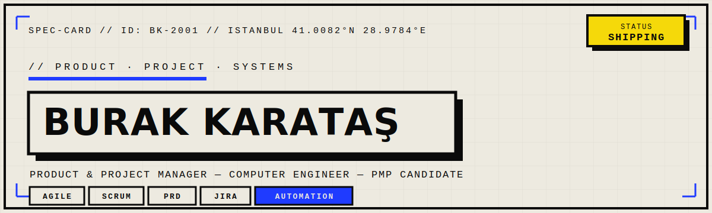

<p align="center">
  
</p>

<p align="center">
  
  
  
</p>

## `// ABOUT`

I own the development of **ten web and mobile products** at **Doktorsitesi.com** — from PRDs and backlog through sprint planning, delivery, and QA. My Computer Engineering background means I speak both stakeholder and developer, and I build tooling that deletes manual work instead of adding to it.

Before product, I shipped code: my repos below are **Ethereum / Solidity** work from my time at **Bitay** and the **Medipol Blockchain Community** — on-chain AML monitoring, transaction tooling, and smart contracts.

```
ROLE     Product & Project Manager @ Doktorsitesi.com
STUDY    MSc Industrial Engineering  ·  BSc Computer Engineering (100% scholarship)
CERT     PMP Candidate — 2026
BUILT    ByBike Micromobility (Founder)
EDGE     Cut the team's manual workload by ~10 hrs / person / week
```

---

## `// STACK`

**Product**
&nbsp;


**Code**
&nbsp;&nbsp;&nbsp;&nbsp;&nbsp;


```
CRAFT   PRD Writing · Roadmapping · Backlog · Sprint Planning · Stakeholder Mgmt
         Agile/Scrum · Cross-functional Delivery · QA & Testing · Workflow Automation
```

---

## `// BUILD LOG` — product

| # | Project | What it does |
|---|---------|--------------|
| 01 | **Institution Panel** | Hospitals onboard, manage & monitor affiliated doctors — customers incl. Medipol, Metrolife & a 10+ hospital chain |
| 02 | **Encrypted Messaging** | Real-time, end-to-end encrypted messaging for doctors + a LinkedIn-style professional connection system |
| 03 | **Subscription Cancellation** | Automated cancellation & refund flow, integrated with billing and payment providers |
| 04 | **Jira × Slack Automation** | Ticket automation built with Claude Skills — saved ~10 hrs / person / week |
| 05 | **ByBike Micromobility** | Founded a micromobility software startup: roadmap, partnerships, investor pitches |

---

## `// REPOS` — on-chain

| Repo | Stack | What it does |
|------|-------|--------------|
| [AML-Monitoring-and-Blacklisting-Software](https://github.com/Medipol-Blockchain-Community-B/AML-Monitoring-and-Blacklisting-Software) | JavaScript | Detects Ethereum wallets interacting with suspicious addresses |
| [Ethereum-Transaction-Data-Downloader](https://github.com/BlackBrandr/Ethereum-Transaction-Data-Downloader) | Python | Downloads full transaction history for any Ethereum address |
| [Fundraiser-Project](https://github.com/BlackBrandr/Fundraiser-Project) | Solidity | Smart-contract fundraising — my Solidity training ground |

---

## `// SIGNALS`

<p align="center">
  
  
</p>

<p align="center">
  
</p>

---

## `// CONNECT`

[](https://www.burakkaratas.com/)
[](https://linkedin.com/in/YOUR-LINKEDIN)
[](mailto:burakkaratas2001@gmail.com)

<sub>`STATUS: SHIPPING` — building products that ship, tooling that saves hours.</sub>
